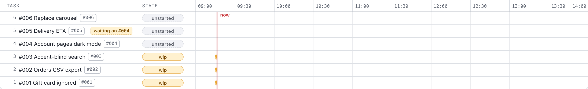
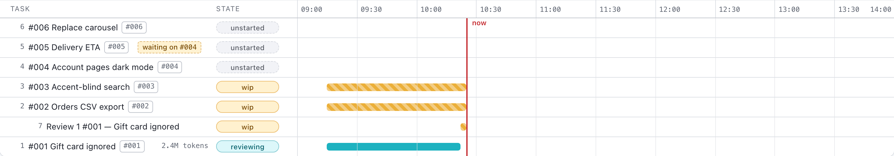
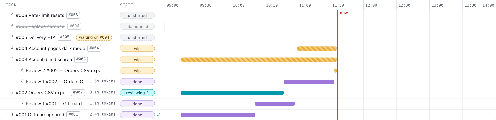
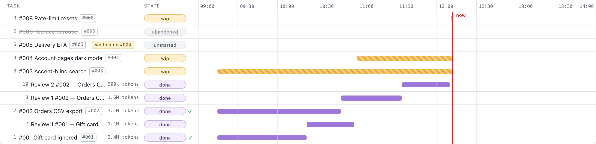
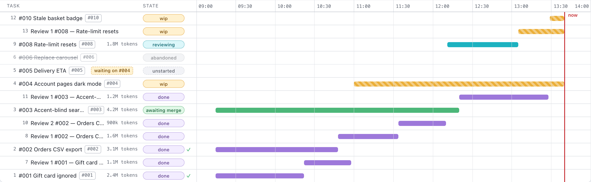

<div align="center">


<h1>agent-progress</h1>

<p><b>A Gantt board for the Claude Code agents building your repository.</b></p>

</div>

<p align="center">
  
</p>

<p align="center"><sub>The Progress tab, light mode. Every dashboard picture on this page shows a demo repository with made-up tickets.</sub></p>

You describe the work; an orchestrator turns it into tickets, a dispatcher runs a builder and then a fresh reviewer for each one, and `main` moves forward one fast-forward at a time. You watch it happen on a single self-contained page that every change redraws, and you edit none of it by hand.

<p align="center">
  <a href="#a-day-on-the-board">A day on the board</a> ·
  <a href="#why-this-works">Why this works</a> ·
  <a href="#both-themes">Both themes</a> ·
  <a href="#get-started-in-three-steps">Get started</a> ·
  <a href="#how-it-fits-together">How it fits together</a>
</p>

## A day on the board

One working morning on **Example Storefront**, a demo repository, with the board's limit set to three agents at once. You talk to one Claude Code session; everything else below is agents and the `agent-progress` CLI.

### 09:02 — You describe six changes

You open Claude Code in the repository, run `/agent-progress-orchestrate` and describe what you want: checkout ignores gift cards, an orders CSV export, accent-blind search, dark mode for the account pages, a delivery ETA, and a new carousel. The orchestrator writes no code. It asks until each request has an acceptance condition an agent can test, then files it with `ticket add`: a Report, what is Wanted, an Acceptance checklist and a Brief its builder will read.

<p align="center">
  
</p>

The gift-card bug is filed high. The delivery ETA depends on dark mode, so its row reads *waiting on #004* until that one is merged.

### 09:15 — Three builders start, one per slot

You say go. The orchestrator launches the dispatcher workflow, which reads the board and starts a builder for each free slot. A builder's first command is `ticket claim`: it counts the free slots and moves the ticket in one lock hold, so two agents can never take the same last slot. Each builder then works in a git worktree of its own, on branch `ticket-001`, `ticket-002`, `ticket-003`; the main checkout is never touched.

<p align="center">
  
</p>

### 10:22 — A builder hands in, and a fresh reviewer tries to prove it wrong

The gift-card builder commits, rebases onto `main`, gets the checks green and writes a Handoff of at most fifteen lines. `ticket review --start-review` moves the ticket to review and opens the reviewer's bar in the same lock hold, so the slot passes from builder to reviewer without ever reading free. The reviewer is a new agent that has not seen the build. Its brief says to show that the ticket does **not** hold and to re-run every claim itself.

<p align="center">
  
</p>

The builder's row now shows 2.4M tokens. Nobody typed that figure: a hook summed the agent's transcript when it stopped.

### 11:34 — 912 lines reworked, so a second round

The gift-card fix was released at 10:58 and reads *done ✓*; its slot went to the dark-mode ticket. The CSV export's first reviewer reworked 912 lines of code, counted by `agent-progress rework` with comments and docs left out. That is over 750, so the dispatcher grants a second round on the count alone, and `ticket rereview --start-review` opens *Review 2* for another fresh reviewer. Meanwhile you filed #008 as high priority; all three slots are busy, so it waits, and no running agent is interrupted. The carousel ticket was abandoned with its reason on record: the redesign removes the carousel.

<p align="center">
  
</p>

### 12:10 — Release: main fast-forwards, the slot is claimed at once

The second reviewer rebases and runs `release`. Under the tracker's lock it checks that the main checkout is on `main` and that the branch descends from it, fast-forwards, marks the ticket delivered and closes the review bars; then it removes the worktree and deletes the branch. Had `main` moved in the meantime, the release would have been refused as `main-moved` and the reviewer would rebase and try again. A minute later #008 claims the freed slot. Nobody ran `git merge`.

<p align="center">
  
</p>

### 13:40 — Where things stand

Seven of thirteen rows are settled, the accent-blind search has passed review and is awaiting merge, #008 is in review, and 16.3M tokens are on the board, row by row. What the reviewers found and did not fix, however small, became low-priority tickets (#007, #009). A low ticket gets no row until it starts, and none starts before every normal and high ticket is merged or abandoned and the orchestrator has triaged it.

Double-click any row for its whole story: each phase it went through, how long it sat there, the ticket and the log lines that name it.

<p align="center">
  
</p>

### The whole day in ten seconds

<p align="center">
  
</p>

## Why this works

| Without a board | With agent-progress |
|---|---|
| Five agents in five terminals, and no one picture of who is on what. | One tracker per repository, found through `git rev-parse --git-common-dir`, so an agent in any worktree writes to the same chart, and every change redraws the page. |
| Agents edit the checkout you are working in, and each other's files. | Every ticket gets its own worktree and branch. `main` only moves through `release`, as a fast-forward. |
| The agent that wrote the code grades its own work. | A fresh reviewer with no builder transcript, told to show the ticket does not hold and to re-run every claim. |
| Review goes around forever, or stops when an agent feels done. | Another round only when a pass reworked over 750 lines of code, counted by the tool. From round three the findings must also converge, or the ticket is parked for you. The rule is code in the dispatcher script, not a prompt. |
| Too many agents at once, and merges that collide. | `ticket claim` checks the limit and takes the slot in one lock hold; `release` fast-forwards under the same lock, and a branch that fell behind is told `main-moved` and rebases. |
| No idea what any of it cost. | A SubagentStop hook sums each agent's transcript and adds everything it processed, cache reads included, to its row. |

"Done" on the chart means merged. Each pill names the state the row is actually in, from *unstarted* and *wip* through *reviewing*, *reviewing 2* and *awaiting merge*, so a row that is finished but not in `main` never reads *done*.

> [!NOTE]
> agent-progress itself makes no network request: no server, no telemetry, no CDN, no web fonts. Its state is plain files in a git-ignored `.agent-progress/`, and the agents it tracks are your own Claude Code sessions.

## Both themes

<p align="center">
  
</p>

The Auto, Light and Dark buttons sit in the page header; Auto tracks your system setting as it changes. The page reloads itself every five minutes, so a tab left open stays current, and it needs no server: it is one file on disk.

## Get started in three steps

### 1. Install the tooling once, with `setup.sh`

```sh
git clone https://github.com/AlexDM0/agent-progress.git
cd agent-progress
./setup.sh
```

<p align="center">
  
</p>

1. **Bun.** Checks that Bun is installed and offers the official installer if it is not. Bun 1.2 or newer is recommended; an older one only gets a warning.
2. **Dependencies and the global command.** Runs `bun install` on every run, then `bun link`, so `agent-progress` works from any directory. If `~/.bun/bin` is not on your `PATH`, it offers to add one export line to `~/.zshrc` or `~/.bashrc`.
3. **The two Claude Code skills.** Symlinks `~/.claude/skills/agent-progress` and `~/.claude/skills/agent-progress-orchestrate` to this checkout, so a `git pull` updates them. Something that is not a symlink at either path is left alone, with a warning.

It touches no repository you work in. Beyond this checkout's own dependencies, the `bun link` and Bun itself if you accept the installer, it writes only the two links under `~/.claude/skills/` and, if you accept, that one line in your rc file.

<sub>`./setup.sh --instruct-only` declines every offer and reports the links it would make; it still runs `bun install` and `bun link`.</sub>

### 2. Adopt a repository with `init`

<p align="center">
  
</p>

`agent-progress init` writes seven things into the repository you run it in:

- **`.agent-progress/`** with the board, a `tickets/` folder and the dashboard, `progress.html`.
- **`.agent-progress/agent-brief.md`**, the brief every builder and reviewer works from.
- **A `.gitignore` entry** for `.agent-progress/`, unless the path is already ignored.
- **A managed block in `CLAUDE.md`**, telling every session in the repository to track its work on the board.
- **A SubagentStop hook** in `.claude/settings.local.json`, which puts each agent's tokens on its row.
- **The dispatcher workflow**, `.claude/workflows/agent-progress-dispatch.js`.
- **The worker agent definition**, `.claude/agents/agent-progress-worker.md`: builders and reviewers run on Opus at medium effort unless a ticket names another model or effort.

`agent-progress update` refreshes the tool's own files later without touching your tickets or log, and `agent-progress open` shows the dashboard.

### 3. Run the board from Claude Code

Open Claude Code in the repository and run `/agent-progress-orchestrate`. It opens the dashboard, tells you what is in flight and takes your requests. Describe the work, answer its questions, and say go. Say stop, and the agents already running finish while unfinished builds wait for the next run.

## How it fits together

<p align="center">
  
</p>

Every change goes through one CLI. Each command that changes the board takes the tracker's lock, writes its files atomically and redraws the page before letting go, so the page never shows a state the board did not hold, and two agents writing at once cannot corrupt it.

<details>
<summary><b>One ticket, start to merge</b></summary>
<br>

<p align="center">
  
</p>

</details>

## Further reading

- **[CLI reference](docs/cli.md)**: every command and flag, the exit codes, the dashboard in detail, the files on disk and what each ticket move does to its row.
- **[Developing agent-progress](docs/development.md)**: getting a checkout running, the three checks, the repository layout, the guard specs, the page and the dispatcher script.
