<p align="center">
  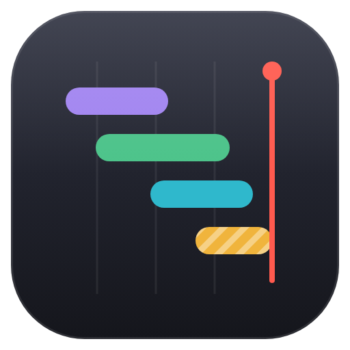
</p>

<h1 align="center">agent-progress</h1>

<p align="center">
  <b>Describe the work. Say go. Watch it merge.</b>
</p>

<p align="center">
  A Bun CLI and two Claude Code skills that turn your requests into tickets, run a builder and a fresh reviewer for each one, and draw all of it on one self-contained page.
</p>

<p align="center">
  <a href="#three-commands">Three commands</a> ·
  <a href="#why-it-works">Why it works</a> ·
  <a href="#under-the-hood">Under the hood</a> ·
  <a href="docs/cli.md">CLI reference</a> ·
  <a href="docs/development.md">Developing agent-progress</a>
</p>

<p align="center">
  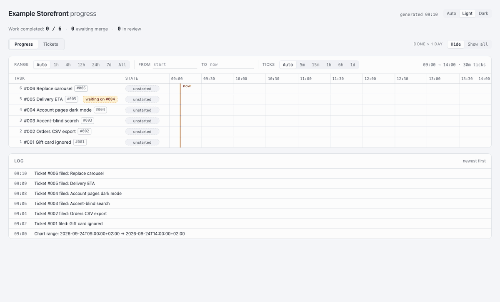
</p>

<p align="center">
  <sub>A synthetic board, Example Storefront, through one working day: 09:10 to 13:40 in ten-minute steps, sped up to ten seconds.</sub>
</p>

<br>

## Watch the work happen.

Every `agent-progress` command redraws `progress.html`: a Gantt row per build and per review, a pill for its state, a red line for now. Keep the tab open; it reloads itself every five minutes.

<p align="center">
  <picture>
    <source media="(prefers-color-scheme: dark)" srcset="docs/images/frame-hero-dark.png">
    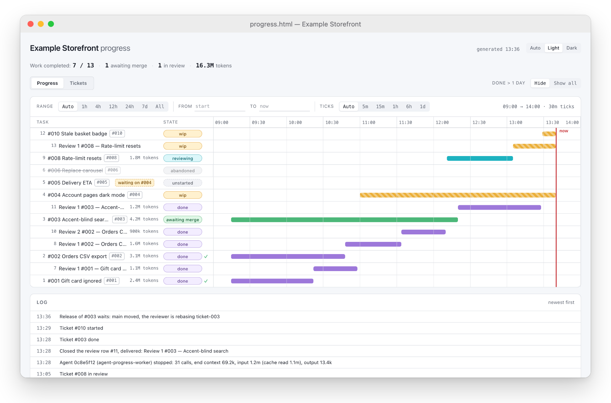
  </picture>
</p>

<br>

## Tickets worth building.

Each request is questioned until it is unambiguous, then filed as a markdown ticket: the report, what is wanted, an acceptance checklist, and the brief its builder reads.

<p align="center">
  <picture>
    <source media="(prefers-color-scheme: dark)" srcset="docs/images/frame-tickets-dark.png">
    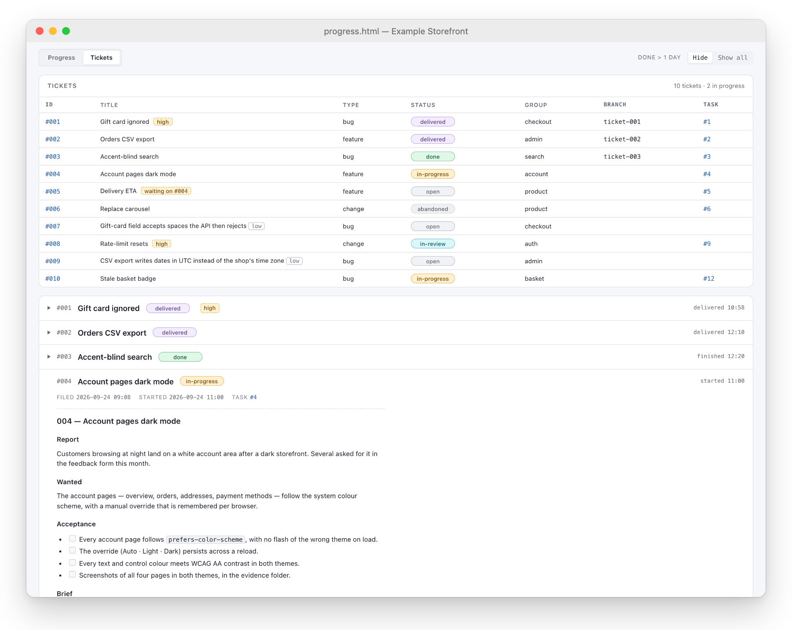
  </picture>
</p>

<br>

## Double-click for the story.

Any row or ticket opens its whole history: who owned it, every phase and how long it took, the ticket body, and each log line that names it.

<p align="center">
  <picture>
    <source media="(prefers-color-scheme: dark)" srcset="docs/images/frame-detail-dark.png">
    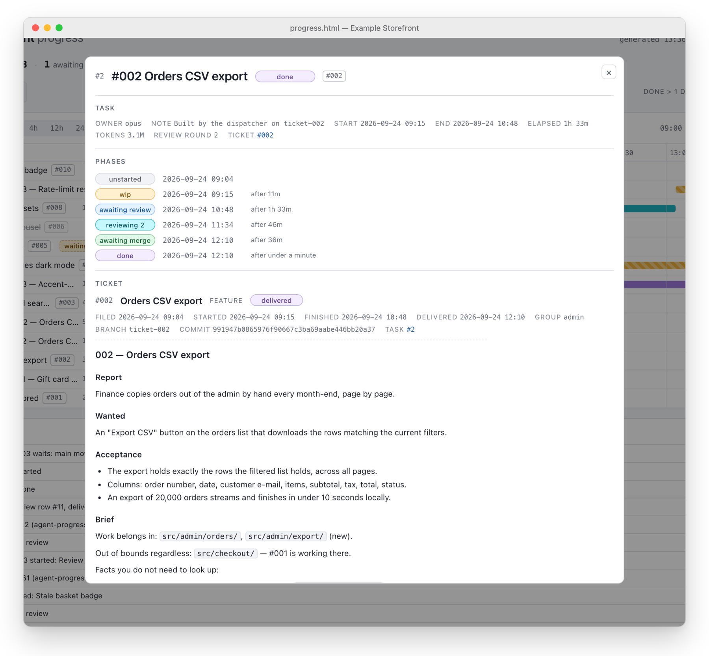
  </picture>
</p>

<br>

## Counted from the transcript.

When an agent stops, a hook reads its transcript and adds everything it processed, cache reads included, to its row. The log keeps a line per agent: calls, end context, input and output.

<p align="center">
  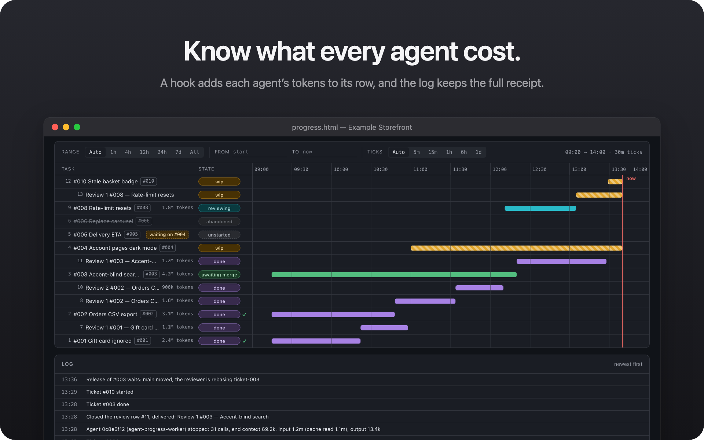
</p>

<br>

## One file. No server.

The page is one HTML file opened from disk, everything inline: no CDN, no web fonts. It follows your system theme, or the one you pick, and remembers the choice.

<p align="center">
  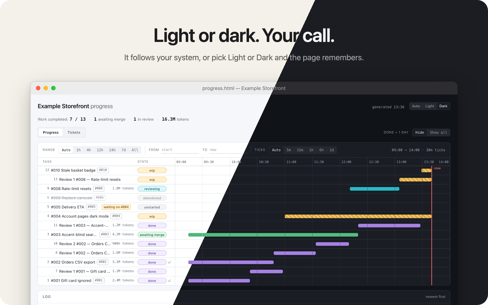
</p>

<br>

## Three commands

```sh
git clone https://github.com/AlexDM0/agent-progress.git
cd agent-progress && ./setup.sh
```

<table>
  <tr>
    <td width="33%" align="center"><b>Install</b><br><sub>once per machine</sub></td>
    <td width="33%" align="center"><b>Adopt</b><br><sub>once per repository</sub></td>
    <td width="33%" align="center"><b>Run</b><br><sub>in Claude Code</sub></td>
  </tr>
  <tr>
    <td align="center"><code>./setup.sh</code></td>
    <td align="center"><code>agent-progress init</code></td>
    <td align="center"><code>/agent-progress-orchestrate</code></td>
  </tr>
  <tr>
    <td>Checks for Bun, installs the global <code>agent-progress</code> command and links the two skills. Touches none of your repositories.</td>
    <td>Writes the tracker, the dashboard and the Claude Code wiring into the repository you run it in.</td>
    <td>Describe the work, answer its questions, say go. Then open the page and watch.</td>
  </tr>
</table>

### What `setup.sh` does

<p align="center">
  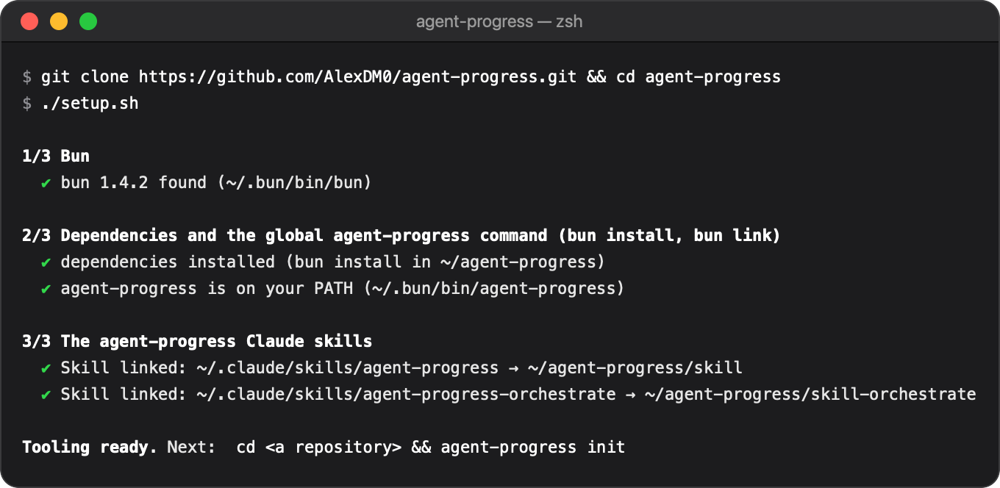
</p>

1. **Bun.** Finds Bun, and offers the official installer when it is missing. 1.2 or newer is recommended; an older version only warns.
2. **The global command.** Runs `bun install` and `bun link` on every run, so `agent-progress` works from any directory. If `~/.bun/bin` is not on your PATH, it offers to add one line to your shell's rc file.
3. **The skills.** Symlinks `agent-progress` and `agent-progress-orchestrate` into `~/.claude/skills/`. Links, not copies, so a `git pull` in this checkout updates every session.

Safe to run again: a correct link is kept, a stale one is relinked, and a real directory in the way is reported and left alone. It writes nothing into your repositories; that is `init`'s job.

### Who does what

<table>
  <tr>
    <td width="33%" valign="top"><b>You</b><br>Describe the work, answer the questions, say go. Only you stop a run.</td>
    <td width="33%" valign="top"><b>The orchestrator</b><br>Your Claude Code session. Grills each request into a ticket with a brief and launches the dispatcher. Writes no code, merges nothing.</td>
    <td width="33%" valign="top"><b>The dispatcher</b><br>A workflow script that starts builders and reviewers within the board's limit and decides review rounds and parking in code.</td>
  </tr>
  <tr>
    <td valign="top"><b>Builders</b><br>One per ready ticket, each in its own git worktree and <code>ticket-&lt;id&gt;</code> branch. Build, rebase, run your checks, write a handoff.</td>
    <td valign="top"><b>Reviewers</b><br>A fresh agent per round that never saw the build. Tries to prove the ticket wrong, fixes what it finds, releases the branch.</td>
    <td valign="top"><b>The CLI</b><br>Every change goes through it: take the lock, write atomically, redraw the page. Nothing is edited by hand.</td>
  </tr>
</table>

<br>

## Why it works

- **A reviewer that never saw the build.** Each round is a new agent that starts from the builder's handoff and the diff, with one instruction: show the ticket does not hold. What it cannot fix within the ticket it files as a low-priority ticket.
- **Rounds decided by a line count.** Another round runs only when a pass reworked over 750 lines of code; comments and docs do not count. From round three the findings must also converge, or the ticket is parked for you.
- **Releases in single file.** `release` checks the branch, fast-forwards main and closes the ticket inside one lock hold. A branch that fell behind rebases and tries again, so main stays a straight line of ticket commits, and "done" on the chart means merged.
- **One board across worktrees.** The tracker is found through git's common directory, so every builder in every worktree writes to the same board, and your main checkout is never edited by a builder.
- **Tokens measured, not guessed.** The hook sums every API call in the agent's transcript, not the end-of-run context figure the harness reports.
- **Crash-safe writes.** Temp file, fsync, rename, under an exclusive lock, with the page redrawn inside the same lock hold. Slots are claimed in that same hold, so two agents racing for the last one cannot both win; a run that died resumes by its run id.

> [!NOTE]
> agent-progress itself makes no network request: no server, no telemetry, no CDN, no web fonts. Its state is plain files in a git-ignored `.agent-progress/`. The agents it tracks are your own Claude Code sessions.

<br>

## Under the hood

<details>
<summary><b>One ticket, start to merge</b></summary>
<br>

1. You describe the work; the orchestrator questions you until it is unambiguous and files the ticket with its brief.
2. On your go, the dispatcher starts a builder for each free slot (two by default, never more than ten).
3. The builder claims the ticket, works in its own worktree, rebases, gets your checks green, writes a handoff and hands its slot to a reviewer.
4. A fresh reviewer tries to prove the ticket wrong, fixes what it finds, and counts the lines it reworked. Over 750, another fresh reviewer takes a round.
5. The reviewer releases: main is fast-forwarded under the lock, the worktree and branch are removed, and the row turns done.

<p align="center">
  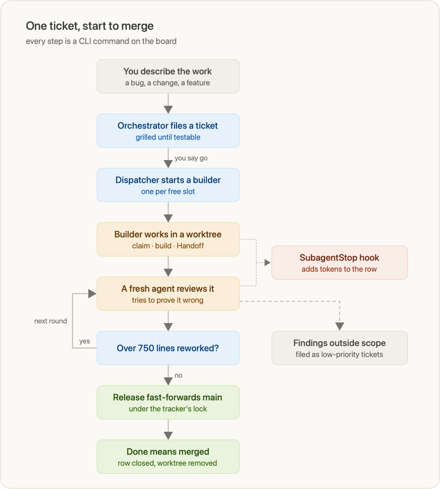
</p>

</details>

<details>
<summary><b>Everything goes through one CLI</b></summary>
<br>

<p align="center">
  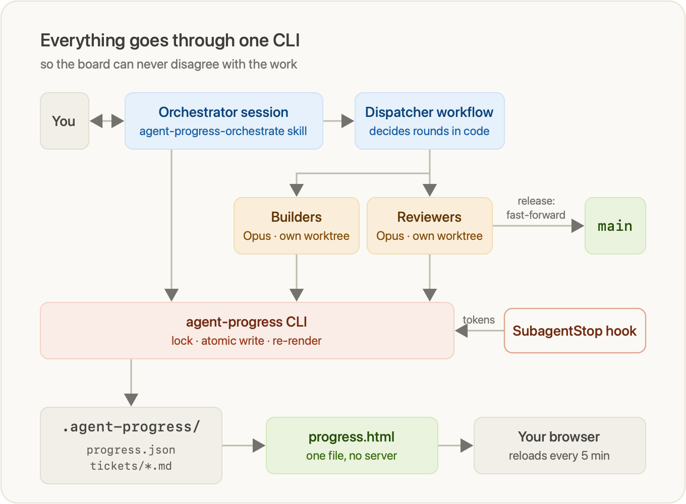
</p>

</details>

<details>
<summary><b>What <code>agent-progress init</code> writes</b></summary>
<br>

<p align="center">
  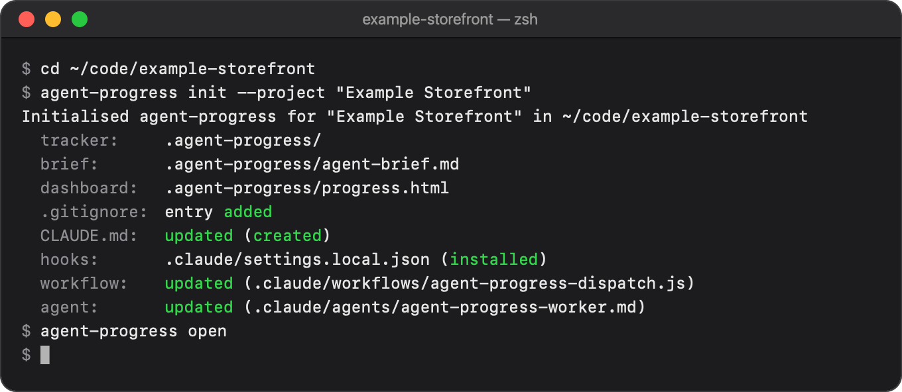
</p>

1. **The tracker**, `.agent-progress/`: the board, a `tickets/` folder, the lock and `progress.html`.
2. **The agent brief**, `.agent-progress/agent-brief.md`, which every builder and reviewer follows.
3. **A `.gitignore` entry** for `.agent-progress/`, unless git already ignores it.
4. **A managed block in `CLAUDE.md`**, between markers, telling every session to track its work here.
5. **The `SubagentStop` hook** in `.claude/settings.local.json`, which puts measured tokens on the rows.
6. **The dispatcher**, `.claude/workflows/agent-progress-dispatch.js`.
7. **The worker agent**, `.claude/agents/agent-progress-worker.md`: Opus at medium effort unless a ticket names another model.

The last four each have an opt-out flag. `agent-progress update` refreshes the tool's own files later and never touches your tickets or log.

</details>

<br>

## Read more

- **[CLI reference](docs/cli.md)**: every command and flag, exit codes, the dashboard, the files on disk and what each ticket move does to its row.
- **[Developing agent-progress](docs/development.md)**: getting a checkout running, the checks, the layout, the guard specs, the page and the dispatcher script.
