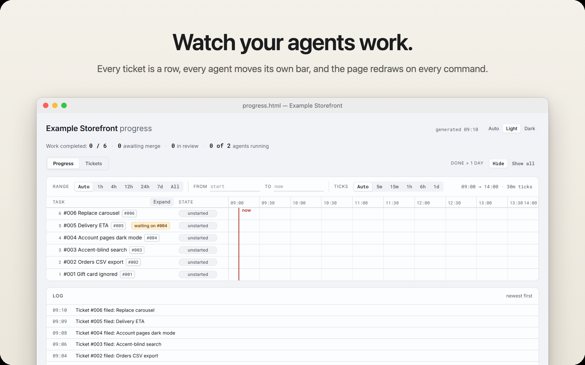
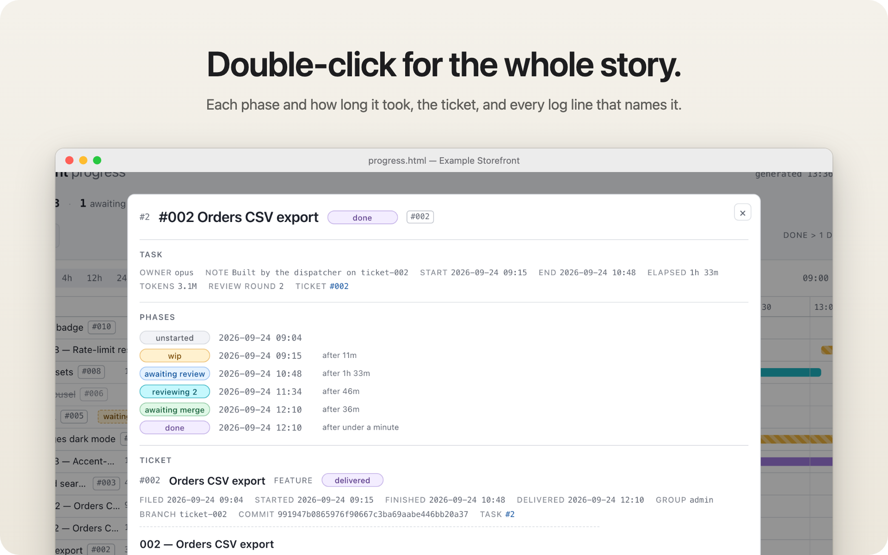
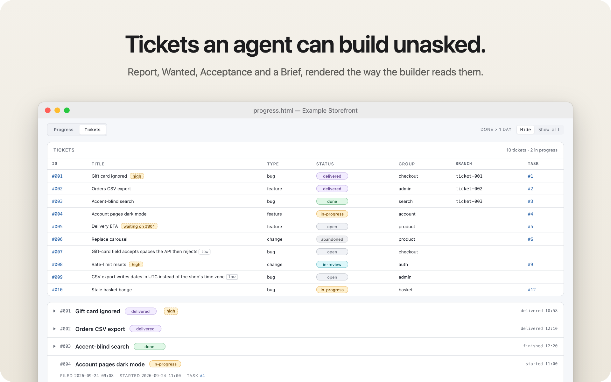

<p align="center">
  
</p>

<h1 align="center">agent-progress</h1>

<p align="center">
  <b>Mission control for your Claude Code agents.</b><br>
  Describe the work. Agents build it in their own worktrees, a fresh agent reviews it, main is fast-forwarded,
  and one self-contained page shows every step as it happens.
</p>

<div align="center">
<table>
  <tr>
    <td align="center"><sub>SKILLS</sub><br><b>2</b><br><sub>for Claude Code</sub></td>
    <td align="center"><sub>CLI</sub><br><b>Bun</b><br><sub>+ TypeScript</sub></td>
    <td align="center"><sub>RUNTIME DEPENDENCY</sub><br><b>1</b><br><sub>marked</sub></td>
    <td align="center"><sub>DASHBOARD</sub><br><b>1 file</b><br><sub>no server</sub></td>
    <td align="center"><sub>AGENTS AT ONCE</sub><br><b>up to 10</b><br><sub>2 by default</sub></td>
  </tr>
</table>
</div>

<br>

<p align="center">
  
</p>

<table>
  <tr>
    <td width="50%" valign="top">
      
    </td>
    <td width="50%" valign="top">
      
    </td>
  </tr>
  <tr>
    <td width="50%" valign="top">
      
    </td>
    <td width="50%" valign="top">
      
    </td>
  </tr>
</table>

## About

Running one coding agent is easy to follow. Running five is not: which one is on what, which branch is
safe to merge, who checked the work, and what did it all cost? The answers end up scattered across
terminal tabs and a context window that gets compacted halfway through the afternoon.

agent-progress puts the answers on a board. You talk to one **orchestrator** session in Claude Code. It
questions you until each request is testable, then files it as a ticket. When you say go, a
**dispatcher** runs a builder agent per ready ticket, hands every finished build to a reviewer agent that
never saw it being written, and releases the result onto main. Every one of those steps is an
`agent-progress` command, and every command redraws `progress.html`. You keep that tab open and watch.
Nothing on the board is edited by hand.

## Highlights

**The board draws itself.** Each command takes the tracker's lock, writes its state atomically and
re-renders the page before letting go. The page can never show a state the files did not hold, and it
reloads itself every five minutes.

**Every ticket gets its own worktree.** Builders work on a `ticket-<id>` branch in `.claude/worktrees/`,
never in your checkout. All worktrees write to one tracker, found through git's common directory, so
five agents still make one chart.

**The reviewer did not write the code.** Each review round is a fresh agent that starts from the builder's
Handoff and the diff, is told to show the ticket does *not* hold, and re-runs every claim itself. It
fixes what is in scope and files everything else as a low-priority ticket.

**The rules live in code, not in prompts.** Slots, review rounds and parking are decided by the
dispatcher script. Another review round happens only when a pass reworked more than 750 lines of code
(comments and docs do not count). Two failed passes park a ticket for you; two agents in a row returning
nothing stop the run as an outage instead of blaming the tickets.

**Releases cannot collide.** `release` checks the ticket, fast-forwards main and closes the review bar in
one lock hold. A branch that fell behind is told `main-moved`, rebases and tries again. On this board
*done* means merged.

**You see what every agent cost.** The `SubagentStop` hook that `init` installs adds everything an agent processed,
cache reads included, to its row. `agent-progress usage` audits the same figures from the transcripts.

## How it works

| Role | Runs as | Does |
|---|---|---|
| **You** | yourself | Describe the work, answer questions, say go, say stop. |
| **Orchestrator** | your Claude Code session, with `/agent-progress-orchestrate` | Files tickets with a brief, launches the dispatcher, triages what comes back. Writes no code, reads no diffs. |
| **Dispatcher** | a Workflow script in `.claude/workflows/` | Starts a builder per free slot, a reviewer per built ticket, decides rounds and parking. |
| **Builder** | a subagent, Opus at medium effort unless the ticket names another | Claims the ticket, builds in its worktree, leaves green checks and a Handoff. |
| **Reviewer** | a fresh subagent, the ticket's same model and effort | Tries to prove the build wrong, fixes, rebases, releases. |
| **CLI and hook** | `agent-progress` | Holds the state, draws the page, records tokens when an agent stops. |

<p align="center">
  
</p>

You can keep filing tickets while a run is going; it picks them up when its next agent returns, and a
high-priority one goes first. Say stop and the agents in flight finish, unfinished builds pause, and the
next run resumes them. The dispatcher's state and run id live on the board, so a compacted or restarted
orchestrator picks up where it left off.

<details>
<summary><b>Where everything goes</b> — the architecture</summary>
<br>
<p align="center">
  
</p>
</details>

## Get started

### 1. Install once

```sh
git clone https://github.com/AlexDM0/agent-progress.git && cd agent-progress
./setup.sh
```

<p align="center">
  
</p>

`setup.sh` runs three steps and changes nothing in your projects:

1. **Bun.** Checks that Bun is there and offers the official installer if it is not. 1.2 or newer is
   recommended; an older one gets a warning, not a refusal.
2. **Dependencies and the global command.** `bun install`, then `bun link`, so `agent-progress` works from
   any directory. If `~/.bun/bin` is not on your `PATH`, it offers to add one line to your shell rc file.
3. **The two skills.** Symlinks `agent-progress` and `agent-progress-orchestrate` into `~/.claude/skills/`.
   Links, not copies, so a `git pull` in this checkout updates both with no reinstall.

It is safe to re-run: a correct link is left alone, a stale one is replaced, and a real file or folder in
the way is reported and never deleted. `./setup.sh --instruct-only` declines every offer and reports the
links it would make; it still runs `bun install` and `bun link`.

### 2. Adopt a repository

```sh
cd ~/code/example-storefront
agent-progress init --project "Example Storefront"
```

<p align="center">
  
</p>

`init` writes seven things:

- **`.agent-progress/`**, the tracker: the state file, a `tickets/` folder, the dashboard and its lock.
- **`.agent-progress/agent-brief.md`**, the brief every builder and reviewer works from.
- **A `.gitignore` entry** for `.agent-progress/`, unless git already ignores it.
- **A managed block in `CLAUDE.md`** telling every session in the repository to track its work here.
- **A `SubagentStop` hook** in `.claude/settings.local.json`, which records each agent's tokens.
- **The dispatcher**, `.claude/workflows/agent-progress-dispatch.js`.
- **The worker agent definition**, `.claude/agents/agent-progress-worker.md`, set to Opus at medium effort.

Each of the last four has an opt-out flag, and `agent-progress update` refreshes the tool's files later
without touching your tickets or log. `agent-progress open` shows the board.

### 3. Run the board

Open Claude Code in the repository and type:

```text
/agent-progress-orchestrate
```

Then describe what you want, one request or ten. Answer the questions until each ticket is testable, and
say **go**. The board fills in from there.

> [!TIP]
> The board allows two agents at once by default. `agent-progress concurrency <n>` raises it, up to ten.

## Privacy

<table>
  <tr>
    <td width="33%" valign="top"><b>No network</b><br><sub>agent-progress itself makes no network request: no server, no telemetry, no CDN, no web fonts.</sub></td>
    <td width="33%" valign="top"><b>Plain files</b><br><sub>All state is JSON and markdown in <code>.agent-progress/</code> at the repository root, git-ignored.</sub></td>
    <td width="33%" valign="top"><b>Your own agents</b><br><sub>The agents it tracks are your own Claude Code sessions. The page's view choices stay in your browser.</sub></td>
  </tr>
</table>

Downloads happen only at setup: `bun install` fetches the packages, and if Bun is missing `setup.sh`
offers its official installer.

## Information

<table>
  <tr>
    <td width="190"><b>Requires</b></td>
    <td>Bun (1.2 or newer recommended), git, Claude Code</td>
  </tr>
  <tr>
    <td width="190"><b>Runs in</b></td>
    <td>your terminal and your Claude Code sessions; the dispatcher runs as a Claude Code Workflow script</td>
  </tr>
  <tr>
    <td width="190"><b>Runtime dependency</b></td>
    <td><code>marked</code>, for ticket bodies on the page</td>
  </tr>
  <tr>
    <td width="190"><b>Storage</b></td>
    <td><code>.agent-progress/</code> at the repository root, shared by every worktree</td>
  </tr>
  <tr>
    <td width="190"><b>Dashboard</b></td>
    <td>one self-contained <code>progress.html</code>: Progress and Tickets tabs, light, dark or auto</td>
  </tr>
  <tr>
    <td width="190"><b>Agents</b></td>
    <td>builders and reviewers on Opus at medium effort, per ticket overridable; 2 at once by default, 10 at most</td>
  </tr>
  <tr>
    <td width="190"><b>Source</b></td>
    <td><a href="https://github.com/AlexDM0/agent-progress">github.com/AlexDM0/agent-progress</a></td>
  </tr>
</table>

## Further reading

- **[CLI reference](docs/cli.md)**: every command and flag, the exit codes, what `init` and `update` write,
  the dashboard in detail and the files on disk.
- **[Developing agent-progress](docs/development.md)**: getting a checkout running, the checks every change
  must pass, the repository layout, the guard specs and the decisions behind the design.
